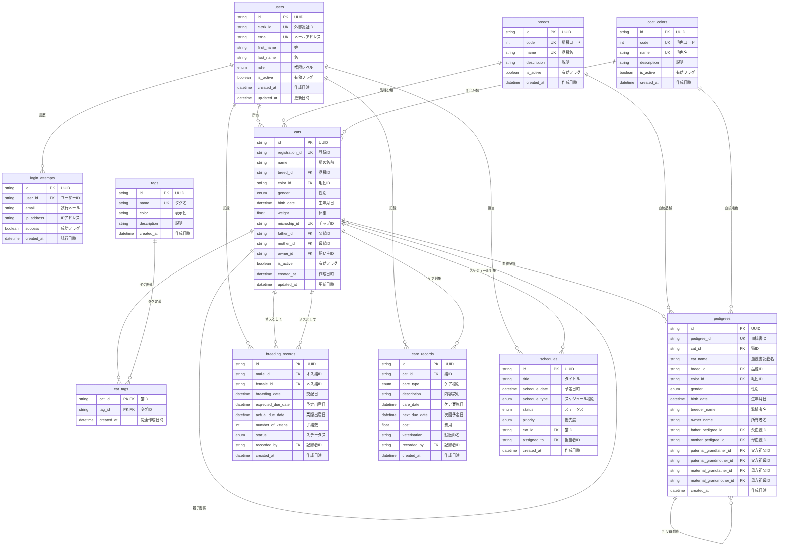
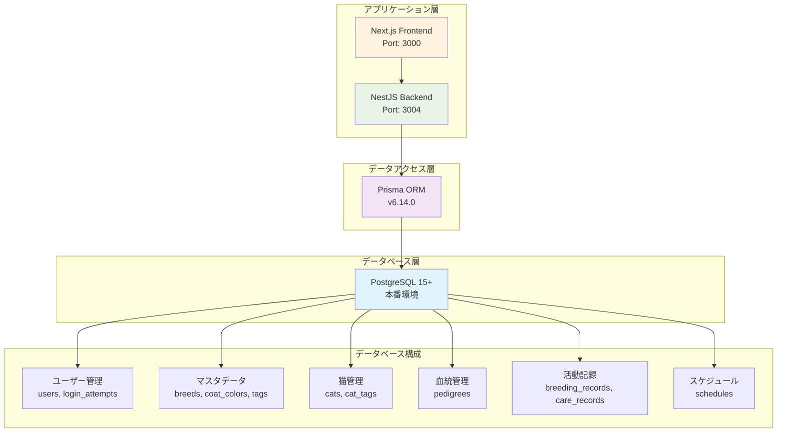
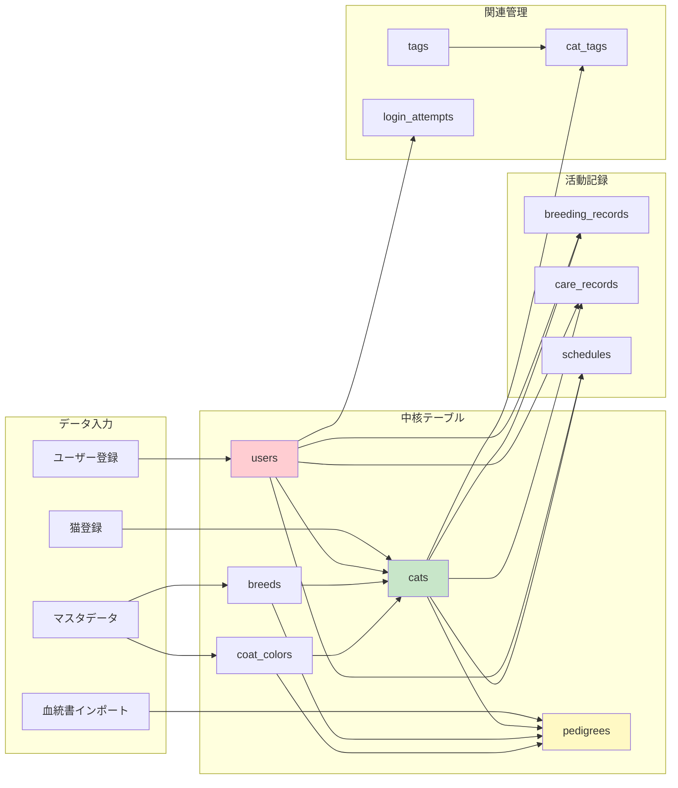

# 🗄️ 本番環境データベース構成図

## ER図（実体関連図）



## システム構成図



## データフロー図



## テーブル関連強度

| 関係の種類               | 強度 | 説明             | 削除時動作 |
| ------------------------ | ---- | ---------------- | ---------- |
| **強い関連**             | 🔴   | 必須の業務関係   | RESTRICT   |
| users ↔ cats            | 🔴   | 所有関係         | RESTRICT   |
| cats ↔ breeding_records | 🔴   | 交配記録         | RESTRICT   |
| **中程度関連**           | 🟡   | 重要だが独立可能 | SET NULL   |
| cats ↔ cats (親子)      | 🟡   | 親子関係         | SET NULL   |
| cats ↔ pedigrees        | 🟡   | 血統関係         | SET NULL   |
| pedigrees ↔ pedigrees   | 🟡   | 血統系譜         | SET NULL   |
| **弱い関連**             | 🟢   | 付加情報         | CASCADE    |
| users ↔ login_attempts  | 🟢   | ログ情報         | CASCADE    |
| cats ↔ care_records     | 🟢   | ケア履歴         | CASCADE    |
| cats ↔ cat_tags         | 🟢   | タグ関係         | CASCADE    |

## パフォーマンス考慮事項

### 重要なインデックス

```sql
-- 検索頻度が高いフィールド
CREATE INDEX idx_cats_owner_id ON cats(owner_id);
CREATE INDEX idx_cats_breed_id ON cats(breed_id);
CREATE INDEX idx_cats_birth_date ON cats(birth_date);

-- 血統検索用
CREATE INDEX idx_pedigrees_father_pedigree_id ON pedigrees(father_pedigree_id);
CREATE INDEX idx_pedigrees_mother_pedigree_id ON pedigrees(mother_pedigree_id);

-- 記録検索用
CREATE INDEX idx_care_records_cat_id_care_date ON care_records(cat_id, care_date);
CREATE INDEX idx_schedules_assigned_to_schedule_date ON schedules(assigned_to, schedule_date);
```

### クエリ最適化パターン

1. **猫の一覧検索**: owner_id + is_active でのフィルタリング
2. **血統検索**: 再帰クエリによる3世代検索
3. **スケジュール検索**: assigned_to + schedule_date の複合インデックス使用
4. **ケア履歴**: cat_id + care_date の範囲検索

---

_この図は本番環境デプロイ時に生成される実際のデータベース構造を表しています。_  
_詳細な仕様: [DATABASE_PRODUCTION_SCHEMA.md](./DATABASE_PRODUCTION_SCHEMA.md)_
