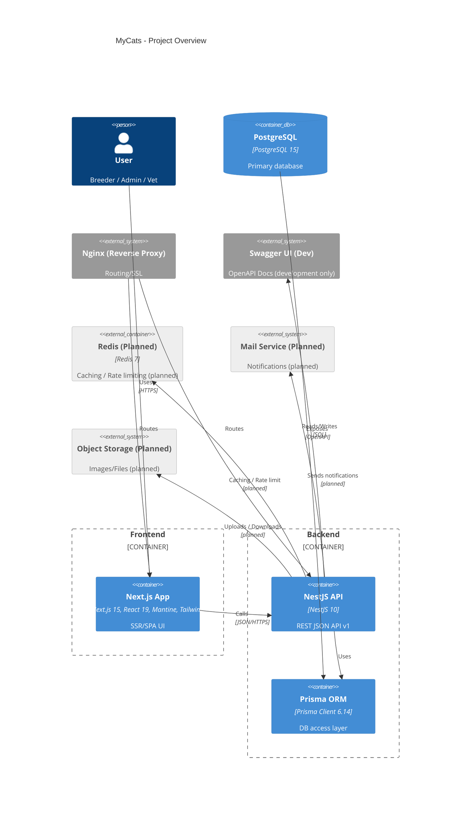
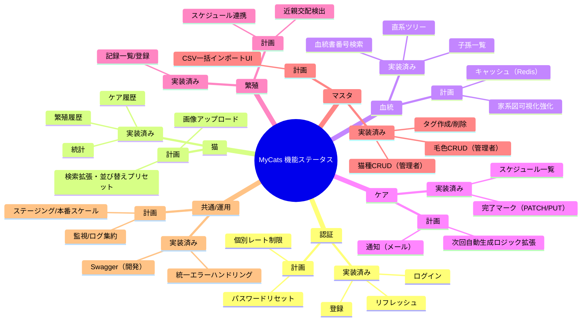

# �️ プロジェクト全体図

## 📦 C4 Container 構成

実装済みは通常色、導入予定候補はグレーで表示しています。



---

## 🗺️ 機能ステータス（実装済み / 導入予定候補）



注: 実装状況は `docs/api-specification.md` とコードの現状から要約しています。詳細は当該ドキュメントをご確認ください。

---

## 🔁 互換版（標準Mermaid Flowchart）

MermaidのC4 / mindmapがレンダリングされない環境向けの簡易図です。

### システム俯瞰（互換）

```mermaid
graph TD
  user[User] --> nginx[Nginx (Reverse Proxy)]
  nginx --> next[Next.js App]
  nginx --> api[NestJS API]
  next --> api
  api --> prisma[Prisma ORM]
  prisma --> db[(PostgreSQL)]
  api -. planned .-> redis[(Redis - planned)]
  api -. planned .-> mail[Mail Service - planned]
  api -. planned .-> storage[Object Storage - planned]
  api --> swagger[Swagger UI (Dev)]

  subgraph Frontend
    next
  end
  subgraph Backend
    api
    prisma
  end
  subgraph Data
    db
    redis
  end
  subgraph External
    nginx
    mail
    storage
    swagger
  end

  style redis fill:#eeeeee,stroke:#999999,color:#555555
  style mail fill:#eeeeee,stroke:#999999,color:#555555
  style storage fill:#eeeeee,stroke:#999999,color:#555555
```

### 機能ステータス（互換）

```mermaid
graph TB
  classDef done fill:#c8e6c9,stroke:#2e7d32,color:#1b5e20
  classDef plan fill:#eeeeee,stroke:#999999,color:#555555

  subgraph 認証
    login[ログイン]:::done
    refresh[リフレッシュ]:::done
    register[登録]:::done
    reset[パスワードリセット]:::plan
    rate[個別レート制限]:::plan
  end

  subgraph 猫
    stats[統計]:::done
    breedingHist[繁殖履歴]:::done
    careHist[ケア履歴]:::done
    search[検索拡張/並び替え]:::plan
    upload[画像アップロード]:::plan
  end

  subgraph 血統
    pedId[血統書番号検索]:::done
    direct[直系ツリー]:::done
    descendants[子孫一覧]:::done
    treeViz[家系図可視化強化]:::plan
    cache[キャッシュ(Redis)]:::plan
  end

  subgraph ケア
    careList[スケジュール一覧]:::done
    careComplete[完了マーク(PATCH/PUT)]:::done
    careNotify[通知(メール)]:::plan
    careNext[次回自動生成ロジック]:::plan
  end

  subgraph 繁殖
    breedingList[記録一覧/登録]:::done
    consanguine[近親交配検出]:::plan
    scheduleLink[スケジュール連携]:::plan
  end

  subgraph マスタ
    breedsCRUD[猫種CRUD(管理者)]:::done
    colorsCRUD[毛色CRUD(管理者)]:::done
    tags[タグ作成/削除]:::done
    csvUI[CSV一括インポートUI]:::plan
  end

  subgraph 共通/運用
    swaggerDev[Swagger(開発)]:::done
    errorHandling[統一エラーハンドリング]:::done
    monitoring[監視/ログ集約]:::plan
    scale[ステージング/本番スケール]:::plan
  end
```

表示されない場合は、VS Codeの「Markdown: Enable Mermaid」を有効化、または最新版のVS Code/拡張機能をご利用ください。
