# 📊 システム構成図

## 🏗️ 全体アーキテクチャ

### システム構成概要図

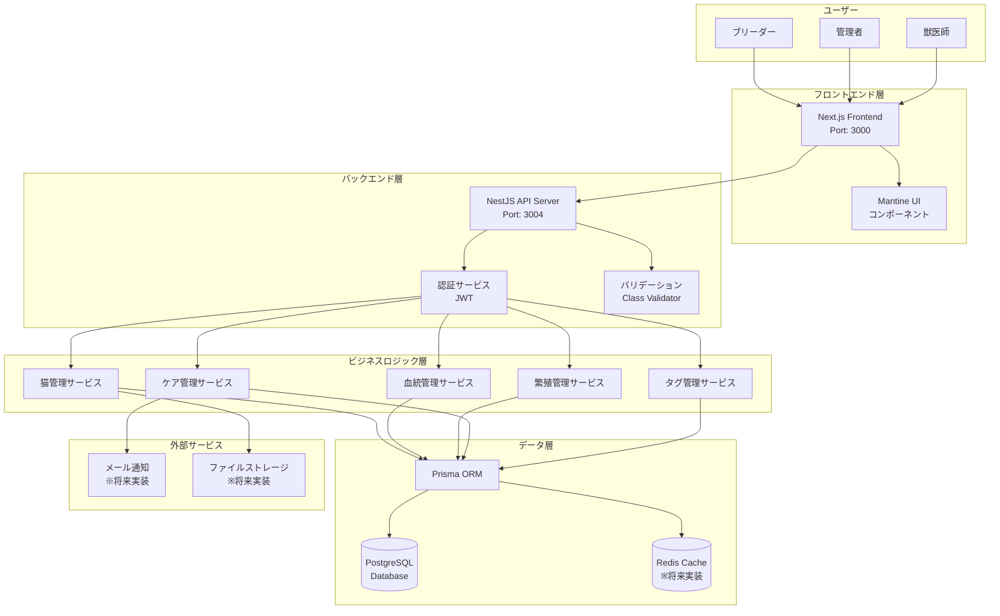

### ネットワーク構成図

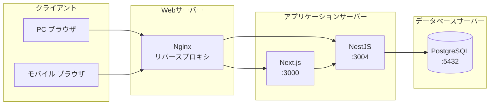

## 🔧 デプロイメント構成

### 開発環境構成

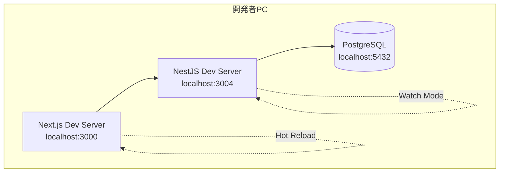

### ステージング環境構成

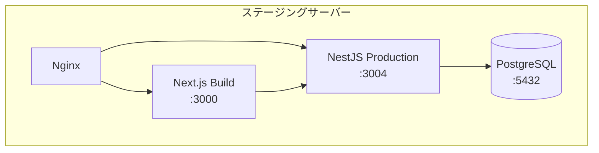

### 本番環境構成（将来）

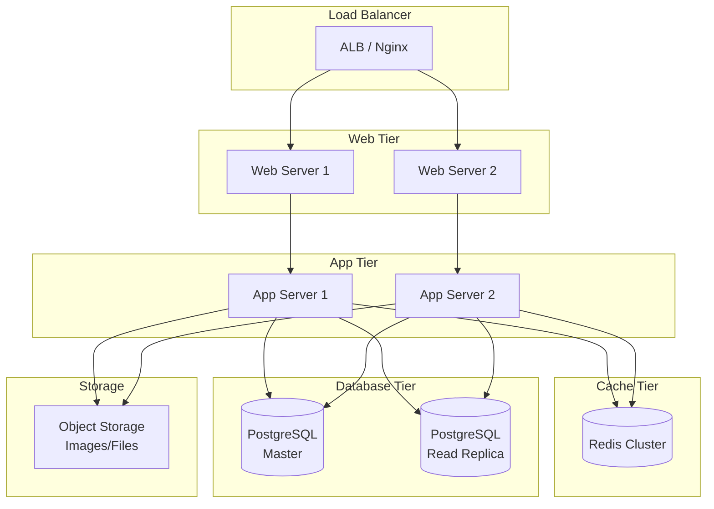

## 🛡️ セキュリティ構成

### 認証・認可フロー

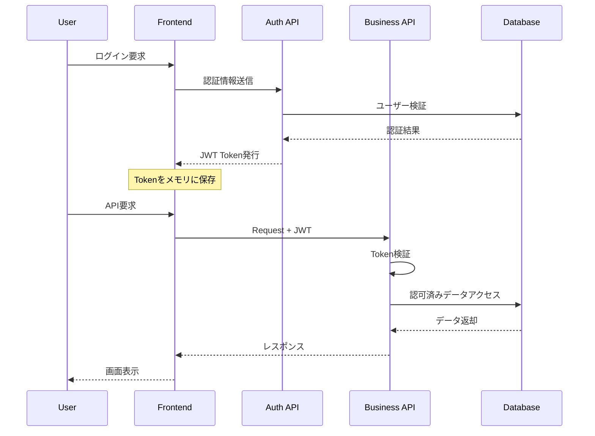

### データアクセス制御

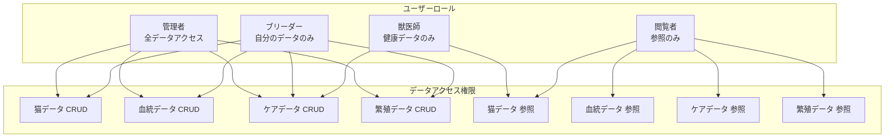

## 📊 データフロー図

### 猫登録フロー

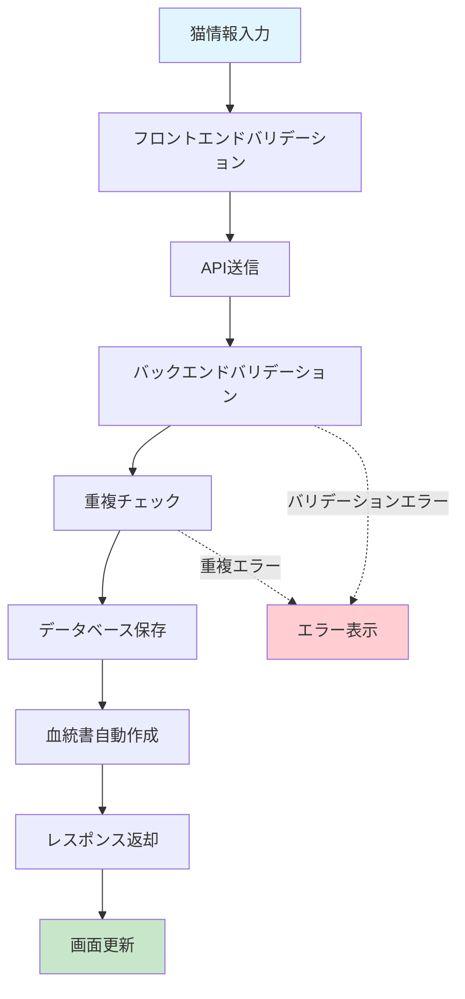

### 血統検索フロー

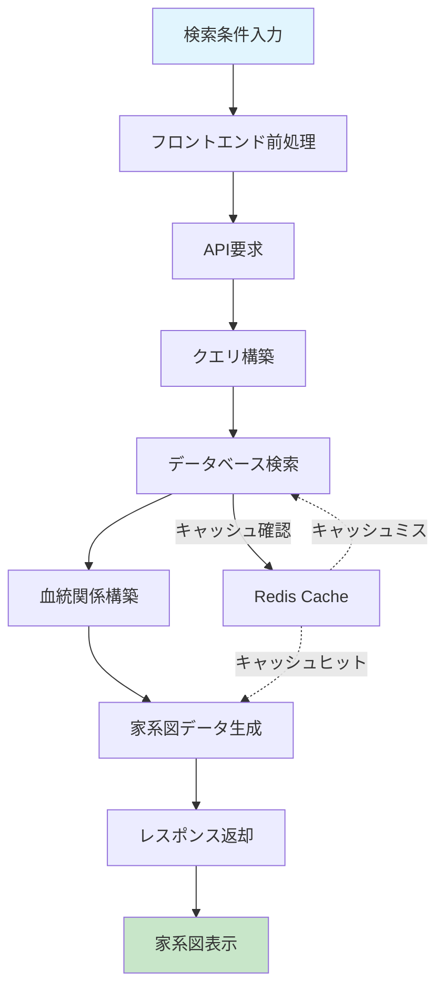

### 繁殖管理フロー

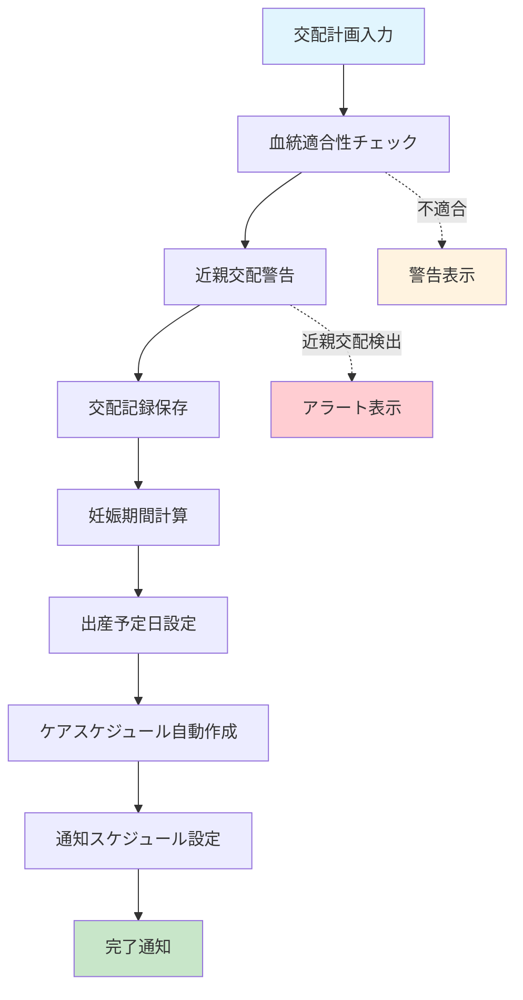

## 🔄 バックアップ・災害復旧

### バックアップ構成

```mermaid
graph TB
    subgraph "本番システム"
        PROD_DB[(本番DB)]
        PROD_FILES[アプリファイル]
    end
    
    subgraph "バックアップストレージ"
        BACKUP_DB[(DBバックアップ<br/>日次・週次)]
        BACKUP_FILES[ファイルバックアップ<br/>日次)]
        BACKUP_CONFIG[設定ファイル<br/>変更時)]
    end
    
    subgraph "オフサイトストレージ"
        OFFSITE_DB[(リモートDBバックアップ<br/>週次)]
        OFFSITE_FILES[リモートファイル<br/>週次)]
    end
    
    PROD_DB -.-> |pg_dump| BACKUP_DB
    PROD_FILES -.-> |tar/rsync| BACKUP_FILES
    PROD_FILES -.-> |git| BACKUP_CONFIG
    
    BACKUP_DB -.-> |転送| OFFSITE_DB
    BACKUP_FILES -.-> |転送| OFFSITE_FILES
```

### 災害復旧手順

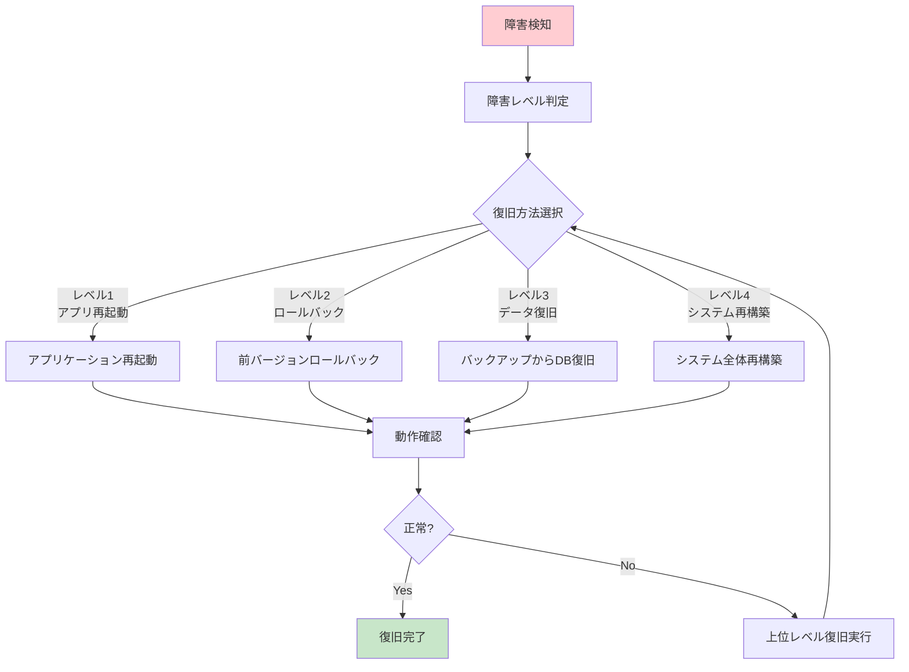

## 📱 将来拡張構成

### マイクロサービス化（将来）

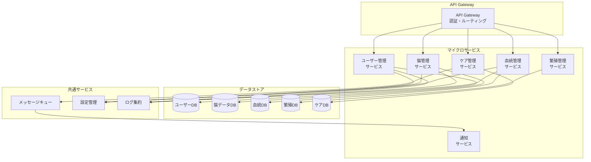

---

**図表バージョン**: 1.0  
**最終更新日**: 2025年8月9日  
**作成者**: システム設計チーム
