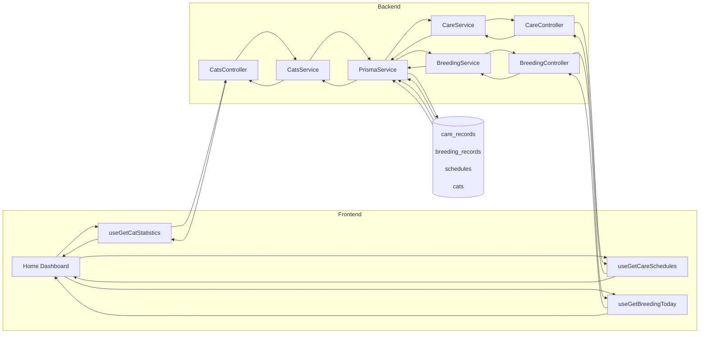
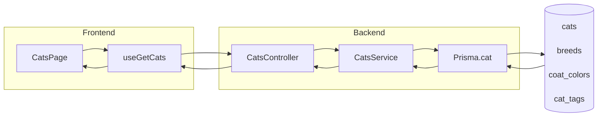
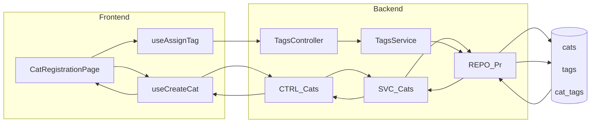
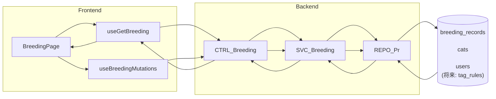
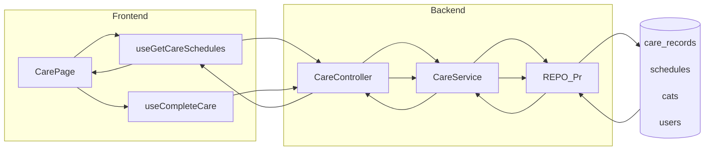
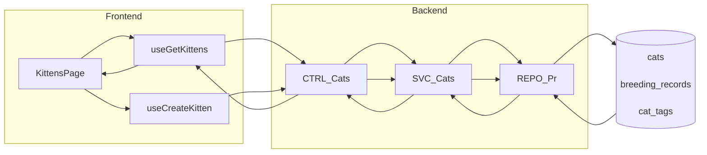
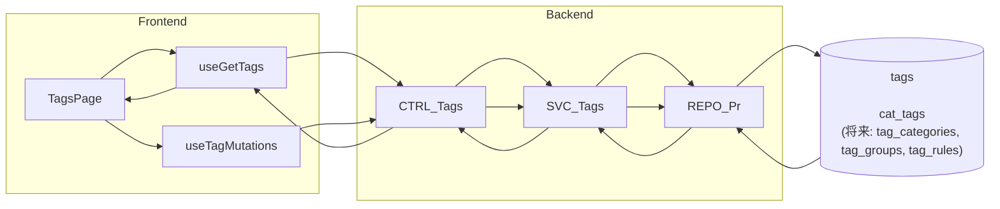
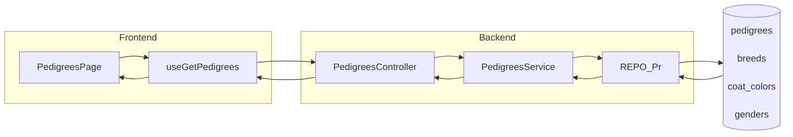
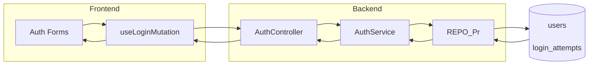

# MyCats 機能要件マスター (2025-10-11)

本書は本番リリースに向けて、フロントエンド UI・バックエンド API・データベースの結び付きを一元化し、誰でも同じ前提で開発を進められるようにするための“中核ドキュメント”です。命名規則ガイドラインに準拠した名称を用い、以下の6項目をカバーします。

1. [共通コンポーネント定義](#1-共通コンポーネント定義)
2. [API クライアント層](#2-api-クライアント層)
3. [ページ別 UI 要件 & フロー](#3-ページ別-ui-要件--フロー)
4. [レスポンス型 (DTO) とフロント側型の同期](#4-レスポンス型-dto-とフロント側型の同期)
5. [API 共通化ポリシー](#5-api-共通化ポリシー)
6. [データベース設計完全版](#6-データベース設計完全版)

---

## 1. 共通コンポーネント定義

| コンポーネント | 役割 / 主な props | 依存モジュール | 利用例 | ノート |
| --- | --- | --- | --- | --- |
| `AppLayout` (`frontend/src/components/AppLayout.tsx`) | Mantine `AppShell` ベースの共通レイアウト。`navigationItems` で主要ページをサイドバーに表示し、ヘッダーにはロゴ・ハンバーガーを配置。 | Mantine Core, Next `usePathname`, `useDisclosure` | すべての会員向けページ (`src/app/**` の `layout.tsx`) | ルート遷移で自動的にサイドバーを折り畳む仕様。アクセシビリティのために `Burger` 状態と `aria` 属性の同期を検討。 |
| `PageTitle` (`frontend/src/components/PageTitle.tsx`) | ページタイトルとサブテキストの表示。`withMarginBottom` / `style` 等でバリアント調整。 | Mantine Core | 各機能ページ上部 (`/cats`, `/breeding` 等) | `PageTitle` が h1 役割を担うため、SEO 上必要な場合は `aria-level` を設定。 |
| `SectionTitle` (`frontend/src/components/SectionTitle.tsx`) | セクション見出しと補足説明をまとめる。 | Mantine Core | ケアタブ内セクションなど | 追加の `description` スロットで操作ガイドを表示可能。 |
| `TagSelector` (`frontend/src/components/TagSelector.tsx`) | タグの多重選択 UI。`selectedTags`, `onChange`, `label`, `placeholder` を受け取り、Mantine `MultiSelect` で描画。 | Mantine Core, `@tabler/icons-react` | `/cats/new`, `/kittens`, `/tags` | 将来的に API 連携する場合は `useGetTags` フックを噛ませて非同期オプションを補充。 |
| `forms/FormField` 等 (`frontend/src/components/forms`) | フォームフィールドのラッパ (`FormField`), カラー入力 (`ColorInputField`), 日付入力 (`DateInputField`) を共通化。 | Mantine Core | 登録・編集フォーム | ラベル/エラー表示の一貫性を保ち、アクセシビリティを確保。将来的に `react-hook-form` の Controller と連携予定。 |

### コンポーネント運用ルール

- **Props の命名**: 命名ガイドラインに従い、対象 → 条件 → 動作の順で `camelCase` を使用。
- **スタイル統一**: Mantine の `var(--surface)` 等の CSS カスタムプロパティを基調に、各コンポーネント内で背景色・ボーダー色を統一。
- **拡張指針**: 共通コンポーネントを追加する場合は `frontend/src/components/README.md (追加予定)` で API を明文化し、必要に応じて Storybook も導入する。

---

## 2. API クライアント層

### 2.1 `apiClient` の構造

- 定義: `frontend/src/lib/api/client.ts`
- ベース URL: `NEXT_PUBLIC_API_URL` (未設定時は `http://localhost:3004/api/v1`)
- 提供メソッド: `get`, `post`, `patch`, `delete`
- 戻り値: 共通レスポンス型 `ApiResponse<T> = { success: boolean; data?: T; error?: string; message?: string }`
- トークン管理: `setTokens` / `getAccessToken` / `getRefreshToken` / `clearTokens` でメモリ・`localStorage`・Cookie を三重管理。

### 2.2 エラーハンドリングとリフレッシュ

- 全リクエストで `Authorization: Bearer <accessToken>` を付与。
- 401 応答時は自動で `/auth/refresh` を叩き、再試行する。失敗した場合はトークンを破棄し `/login` へリダイレクト。
- ネットワークエラーや想定外の HTTP エラーは `ApiError` (status, response payload 付き) として throw。フロント側では Mantine Notifications でユーザー通知。

### 2.3 React Query フック

- 代表例: `useGetCats` (`frontend/src/lib/api/hooks/use-cats.ts`)
  - クエリキー: `catKeys`
  - 一覧取得: `GET /cats`
  - `useMutation` を通じて作成 (`POST /cats`), 更新 (`PATCH /cats/:id`), 削除 (`DELETE /cats/:id`)
  - 成功/失敗時に `notifications.show` を呼び出し、UI フィードバックを統一。
- 新規ドメイン (例: ケア, 交配, タグ) も同じパターンで `hooks/use-<domain>.ts` を実装し、TanStack Query によりキャッシュ戦略を共通化。

### 2.4 レガシー API ユーティリティ

- `frontend/src/lib/api.ts` に `apiGet`, `apiPost` 等の薄いラッパが残存。
- `pedigrees` ページ等で利用中。段階的に `apiClient` / React Query へ移行し、トークン付与・エラーハンドリングを一元化する。

---

## 3. ページ別 UI 要件 & フロー

各ページについて、UI 機能・呼び出す API・取り扱う DTO・参照テーブル、そして UI→API→DB フローを整理します。

### 3.1 ダッシュボード (`/`)

| 項目 | 内容 |
| --- | --- |
| 主な UI | 日次ダッシュボードカード、ケアチェックリスト、交配予定、クイックアクション。 |
| API | `GET /cats/statistics` (頭数集計)、`GET /care/schedules?date=today`、`GET /breeding?date=today` (将来実装)。 |
| DTO | `CatStatisticsResponse`, `CareScheduleListResponse`, `BreedingListResponse` (新規定義)。 |
| DB | `cats`, `care_records`, `schedules`, `breeding_records`。 |
| 備考 | 現状はスタブデータ。React Query で統合し、優先度タグや完了状態の永続化を `care_records` / `schedules` に持たせる。 |

### 3.2 在舎猫一覧 (`/cats`)

| 項目 | 内容 |
| --- | --- |
| 主な UI | 検索バー、タブ (全体/性別/子猫/在舎)、ソート、カード一覧。 |
| API | `GET /cats` (パラメータ: page, limit, search, gender, breedId, coatColorId, isInHouse)。 |
| DTO | `CatQueryDto` (バックエンド), `GetCatsParams` / `GetCatsResponse` (フロント), `Cat` 型。 |
| DB | `cats`, `breeds`, `coat_colors`, `cat_tags`。 |
| 備考 | 年齢算出はフロントで実施。`isInHouse` フィールドはバックエンド側で `Boolean` カラム追加予定。 |

### 3.3 猫登録・編集 (`/cats/new` 他)

| 項目 | 内容 |
| --- | --- |
| 主な UI | 登録タブ / 編集タブ、`TagSelector` による特徴設定。 |
| API | `POST /cats`, `PATCH /cats/:id`, `POST /tags/cats/:id` (タグ付与), `DELETE /tags/cats/:id/tags/:tagId` (剥奪)。 |
| DTO | `CreateCatDto`, `UpdateCatDto`, `AssignTagDto` / フロント `CreateCatRequest`, `UpdateCatRequest`。 |
| DB | `cats`, `cat_tags`, `tags`。 |
| 備考 | 現状フォームはローカル状態のみ。`react-hook-form` + Zod でバリデーションを共通化予定。 |

### 3.4 交配管理 (`/breeding`)

| 項目 | 内容 |
| --- | --- |
| 主な UI | カレンダービュー、NG ペアルール管理、妊娠チェック、出産計画。 |
| API | `GET /breeding` (履歴/予定一覧), `POST /breeding`, `PATCH /breeding/:id`, `DELETE /breeding/:id`。 |
| DTO | `BreedingQueryDto`, `CreateBreedingDto`, `UpdateBreedingDto`。 |
| DB | `breeding_records`, `cats`, `users` (recordedBy)。 |
| 備考 | 現在はモックデータ。NG ルールは `TagRule` テーブルで管理し、判定ロジックをサービス層に実装予定。 |

### 3.5 ケア管理 (`/care`)

| 項目 | 内容 |
| --- | --- |
| 主な UI | ケアスケジュール一覧、完了チェック、フィルタリング。 |
| API | `GET /care/schedules`, `POST /care/schedules`, `PATCH /care/schedules/:id/complete`。 |
| DTO | `CareQueryDto`, `CreateCareScheduleDto`, `CompleteCareDto`。 |
| DB | `care_records`, `schedules`, `cats`, `users`。 |
| 備考 | `CompleteCareDto` で完了日時・実施者を記録。完了操作は `PATCH` / `PUT` どちらでも可能 (API 側で対応済み)。 |

### 3.6 子猫管理 (`/kittens`)

| 項目 | 内容 |
| --- | --- |
| 主な UI | 母猫ごとのアコーディオン、子猫の登録モーダル、タグフィルタ。 |
| API | `GET /cats?status=kitten`, `POST /kittens` (要新設), `PATCH /kittens/:id`。 |
| DTO | `KittenListResponse` (新設), `CreateKittenDto`, `UpdateKittenDto` (将来)。 |
| DB | `cats` (子猫も同テーブル), `breeding_records`, `tag` 系テーブル。 |
| 備考 | 現状ローカル状態。`cats` テーブルに `isKitten`, `motherId` を持たせることで、母子関係を抽出。 |

### 3.7 タグ管理 (`/tags`)

| 項目 | 内容 |
| --- | --- |
| 主な UI | カテゴリタブ、タグ一覧、モーダルによる作成・編集。 |
| API | `GET /tags`, `POST /tags`, `DELETE /tags/:id`, `POST /tags/cats/:id` (付与), `DELETE /tags/cats/:id/tags/:tagId` (剥奪)。 |
| DTO | `CreateTagDto`, `AssignTagDto`, `TagResponse`。 |
| DB | `tags`, `cat_tags`, (将来) `tag_categories`, `tag_groups`, `tag_rules`。 |
| 備考 | 現状はローカル配列。カテゴリ → グループ → タグの 3 階層に対応するため、`tag_categories`, `tag_groups`, `tags` の3テーブル構造に拡張する。 |

### 3.8 血統書データ (`/pedigrees`)

| 項目 | 内容 |
| --- | --- |
| 主な UI | 検索フィールド、性別フィルタ、テーブル表示、ページネーション。 |
| API | `GET /pedigrees`, `GET /pedigrees/:id`, `POST /pedigrees`, `PATCH /pedigrees/:id`。 |
| DTO | `PedigreeQueryDto`, `PedigreeResponse`。 |
| DB | `pedigrees`, `breeds`, `coat_colors`, `genders`。 |
| 備考 | 現在 `api.ts` の `apiGet` を使用。React Query + `apiClient` へ移行し、`gender`/`breed` のリレーション取得を Prisma の `include` で補強する。 |

### 3.9 認証・アカウント (`/login`, `/register`, `/forgot-password`, `/reset-password`)

| 項目 | 内容 |
| --- | --- |
| 主な UI | ログインフォーム、登録フォーム、パスワードリセット。 |
| API | `POST /auth/login`, `POST /auth/register`, `POST /auth/request-password-reset`, `POST /auth/set-password`, `POST /auth/refresh`, `POST /auth/logout`。 |
| DTO | `LoginDto`, `RegisterDto`, `RequestPasswordResetDto`, `SetPasswordDto`。 |
| DB | `users`, `login_attempts`。 |
| 備考 | 成功時 `setTokens` でトークンを保存。`JwtAuthGuard` により保護される API は `middleware.ts` 経由でフロントルートも制御。 |

---

## 4. レスポンス型 (DTO) とフロント側型の同期

1. **ソース・オブ・トゥルース**: NestJS 側の DTO (`backend/src/**/dto/*.ts`) と Swagger (`@nestjs/swagger`) を唯一の真実とする。
2. **OpenAPI 生成**: `pnpm --filter backend swagger:gen` (例) で `openapi.json` を出力。
3. **型生成**: フロントで `pnpm --filter frontend generate:openapi` を実行し、`frontend/src/lib/api/generated/schema.ts` に `paths` / `components` を生成。
4. **フックの型適用**: React Query フックで `ApiResponse<paths['/cats']['get']['responses']['200']['content']['application/json']>` のように型安全にする。
5. **CI チェック**: Swagger と生成済み型の乖離を検出するジョブ (差分チェック) を GitHub Actions に追加。差分がある場合は PR で再生成を強制。
6. **手動プロパティ**: OpenAPI が表現しづらい派生値 (例: `ageLabel`) は `frontend/src/types/view-models.ts` に別定義し、`transformer` 関数で API レスポンスを UI 向けに加工する。

---

## 5. API 共通化ポリシー

- **レスポンス形式の統一**: `TransformResponseInterceptor` で `{ success: true, data, meta? }` に正規化。`meta` が存在する場合は pagination 情報を格納。
- **エラーハンドリング**: `GlobalExceptionFilter` により `{ success: false, error: { code, message, details? }, timestamp, path }` を返却。Prisma `P2002/2025/2003/2014` は HTTP ステータスとコードをマッピング済み。
- **認証ガード**: `JwtAuthGuard` をコントローラ単位で適用。`@ApiBearerAuth()` 装飾子で Swagger 上も可視化。
- **ロギング**: 代表的な操作 (`CatsController.create/update/delete`) では `Logger` を使用し、監査ログを Cloud Logging 等へ送出予定。
- **検証レイヤー**: DTO は `class-validator` + `class-transformer` を利用。日付は ISO8601、UUID は `ParseUUIDPipe` でバリデーション。
- **命名整合**: Prisma モデルは PascalCase, テーブル名は snake_case 複数形 (命名ガイド指南通り)。API レスポンスのプロパティは `camelCase`。

---

## 6. データベース設計完全版

PostgreSQL (Prisma) により生成されるテーブルの一覧とリレーション。

| テーブル | 主キー / ユニーク | 主な列 | リレーション |
| --- | --- | --- | --- |
| `users` | `id` (UUID), `clerk_id`, `email` | `role`, `is_active`, 認証トークン/ロック制御, `created_at`, `updated_at` | `breeding_records.recorded_by`, `care_records.recorded_by`, `schedules.assigned_to`, `login_attempts.user_id` |
| `login_attempts` | `id` | `user_id`, `email`, `ip_address`, `success`, `reason`, `created_at` | 多対1で `users` (Cascade) |
| `breeds` | `id`; Unique: `code`, `name` | `description`, `is_active`, timestamps | `cats`, `pedigrees` (コード参照) |
| `coat_colors` | `id`; Unique: `code`, `name` | `description`, `is_active`, timestamps | `cats`, `pedigrees` |
| `genders` | `id`; Unique: `code`, `name` | `description`, `is_active` | `pedigrees` |
| `cats` | `id`; Unique: `registration_id`, `microchip_id` | `name`, `gender`, `birth_date`, `breed_id`, `color_id`, `father_id`, `mother_id`, `is_active`, `notes`, `image_url`, `created_at`, `updated_at` | 自己参照 (父母/子供), `breeds`, `coat_colors`, `breeding_records`, `care_records`, `schedules`, `cat_tags` |
| `breeding_records` | `id` | `male_id`, `female_id`, `breeding_date`, `expected_due_date`, `actual_due_date`, `number_of_kittens`, `status`, `notes`, `recorded_by` | 多対1で `cats` (雄/雌), `users` |
| `care_records` | `id` | `cat_id`, `care_type`, `care_date`, `next_due_date`, `cost`, `notes`, `recorded_by` | 多対1で `cats`, `users` |
| `schedules` | `id` | `title`, `schedule_date`, `schedule_type`, `status`, `priority`, `cat_id`, `assigned_to` | 多対1で `cats?`, `users` |
| `tags` | `id`; Unique: `name` | `color`, `description`, timestamps | 多対多で `cats` (`cat_tags` 経由) |
| `cat_tags` | 複合 PK: (`cat_id`, `tag_id`) | `created_at` | 多対1で `cats` (Cascade), `tags` (Cascade) |
| `pedigrees` | `id`; Unique: `pedigree_id` | 血統詳細列 (70+), `breed_code`, `gender_code`, `coat_color_code`, timestamps | 多対1で `breeds`(code), `coat_colors`(code), `genders`(code) |

### 今後追加予定の補助テーブル

- `tag_categories`, `tag_groups`: タグの三階層化。
- `tag_rules`: 自動付与/剥奪ルール (`trigger_type`, `conditions` JSON, `action`)。
- `kitten_growth_records`: 子猫の体重/健康ログ。
- `care_templates`: リマインダーや推奨ケア項目のプリセット。

## 付録: 今後のアクションアイテム (抜粋)

- React Query フックを猫以外のドメインにも展開し、`api.ts` を段階的に廃止。
- Swagger 生成と型同期の CI ジョブを追加し、ズレを検知自動化。
- タグ三階層モデル (`tag_categories` など) とルールベース自動付与の Prisma スキーマ改修を計画。
- ダッシュボード / 交配 / ケア / 子猫ページのモックデータを API 連携に置換し、ステート管理を統一。

### 更新履歴

- 2025-10-11: 初版作成 (GitHub Copilot)
