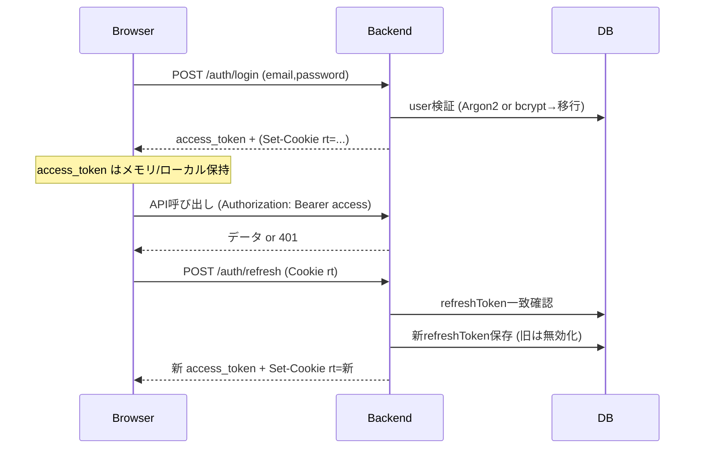

# 認証 & セッション セキュリティガイド

本ドキュメントは本番運用を念頭に、現在の JWT / Refresh Token / Cookie 設計と推奨運用・将来変更計画を整理します。

## 1. 現行アーキテクチャ概要

| 項目 | 内容 |
|------|------|
| 認証方式 | JWT (Access + Refresh) |
| ハッシュ | Argon2id (bcrypt 段階的移行: ログイン成功時に再ハッシュ) |
| Access Token 有効期間 | 15分 (AuthService.login内 signAsync 明示) |
| Refresh Token 有効期間 | 7日 (DB保存 + Cookie保存) |
| Refresh 形態 | 1ユーザー1最新トークン (ローテーション: 更新毎にDB上書き) |
| Refresh 保管 | `users.refreshToken` (平文 JWT) → 今後ハッシュ化検討 |
| Cookie 名 | `rt` (Refresh Token のみ) |
| Cookie 属性 | HttpOnly / SameSite=Lax / Path=/ / Secure(本番のみ) / Max-Age=7d |

## 2. フロー



## 3. セキュリティ判断メモ

| リスク | 現状の評価 | 緩和策/計画 |
|--------|------------|-------------|
| XSS による Refresh Token 窃取 | HttpOnly により軽減 | CSP / Helmet / ライブラリアップデート徹底 |
| CSRF (Refresh 悪用) | SameSite=Lax で通常フォーム送信は多く防止 | 状況により SameSite=Strict / CSRFトークン検討 (将来 access cookie 化時) |
| Refresh Token 盗難 (DB漏洩) | 平文格納のため利用可能 | Phase1: ハッシュ化 (bcrypt/argon2) + 比較ロジック導入 |
| トークンリプレイ | ローテーションで旧rtはDB不一致→拒否 | 失効時は即 logout 処理で再利用失敗をログ化 |
| 多端末利用 | 1カラム上書きのため最後のログインのみ有効 | 複数端末要件発生時は refreshToken テーブル化 |
| 長期放置セッション | 7日保持 | 本番要件に応じ 30分 idle + Refresh短縮 or Sliding Expiry |
| ブルートフォース (login) | loginAttemptService で記録/ロック (実装済/詳細別doc) | lockDuration/閾値チューニング & 監査ログ可視化 |

## 4. 本番推奨設定 (.env)

```env
NODE_ENV=production
JWT_SECRET=<<十分長いランダム文字列>>
JWT_REFRESH_SECRET=<<別のランダム文字列>>
PORT=3004
ARGON2_MEMORY_COST=65536
ARGON2_TIME_COST=3
ARGON2_PARALLELISM=4
ARGON2_HASH_LENGTH=64
ARGON2_SALT_LENGTH=32
```

追加推奨:

- `TRUST_PROXY=1` (ロードバランサ越しで `req.secure` 判定が必要になる場合)
- `LOG_LEVEL=info` or `warn` (不要な詳細ログ抑制)

## 5. 改善ロードマップ

| フェーズ | 対応 | 目的 |
|----------|------|------|
| P0 | (完了) Refresh Cookie + Rotation | 再ログイン省力化 |
| P1 | RefreshToken ハッシュ化 | DB漏洩リスク低減 |
| P2 | Access Token Cookie (HttpOnly + SameSite) + CSRF対策導入 | XSS/Token漏洩面積縮小 |
| P3 | Token Versioning (user.tokenVersion) | 強制失効を簡易化 |
| P4 | Multi-Session対応 (devices table) | 端末別管理・revoke |
| P5 | リスクベース (IP変動/UA変化監査) | セッション悪用検出 |

## 6. Refresh Token ハッシュ化案 (P1)

1. `users` テーブルに `refreshTokenHash` 追加 (既存 `refreshToken` カラムを移行用に保持 or rename)
2. 新トークン発行時: Argon2 でハッシュ化し保存
3. 検証: 送信されたトークンを verify (argon2.verify)
4. 移行: 既存平文カラムがあれば一度refreshでハッシュへ移行→旧カラム削除

## 7. Access Token Cookie 化 (P2) の注意

| 項目 | 現状 | 変更後 | 注意 |
|------|------|--------|------|
| 保存先 | メモリ/LS/Cookie(非HttpOnly) | HttpOnly Cookie | SSRで状態判定が容易になる |
| CSRF | 影響小 | 必要 | `/auth/*` POST に CSRFトークン or Double Submit |
| 404/SSR判定 | クライアント側で遅延 | 初期リクエストで判定 | 早期リダイレクト可能 |

## 8. ログ/監査

最低限記録 (PII避けトークナイズ推奨):

- login success/fail (userId/email(ハッシュ), IP, UA, reason)
- refresh success/fail (userId, IP)
- logout/forced revoke
- password change/reset events

## 9. インシデント対応プレイブック (簡易)

| シナリオ | 即時対応 | 続くステップ |
|----------|----------|--------------|
| Refresh Token 侵害 | 全ユーザー tokenVersion++ or refreshTokenHash null 化 | 強制再ログイン告知 |
| JWT 秘密鍵漏洩 | 新秘密鍵にローテーション (Grace無し) | ローテーション後旧キー無効ログ監視 |
| 不審ログイン急増 | レート制限強化 / IP ブロック | 失敗ログ解析・パスワードリセット通知 |

## 10. 既知の制限

- Refresh Token 平文化 (P1で解消予定)
- 端末毎セッション分離なし
- Access Token を Cookie 化していないため SSR レベル保護が不完全

## 11. 簡易Q&A

**Q: なぜ Access Token をまだ Cookie 化していない?**  
開発初期の実装速度とデバッグ容易性を優先。Cookie 化時は CSRF 対策セットで導入予定。

**Q: Token 有効期間はどのように決めた?**  
15m は一般的ベースライン。短くしすぎるとリフレッシュ頻度増 → 負荷。7d は UX と侵害リスクのトレードオフ点。

**Q: Multi-session が必要になったら?**  
`user_sessions` (id, userId, refreshTokenHash, ua, ip, lastUsedAt, revokedAt) 追加し端末別 revoke。

---
Last Update: 2025-10-03
