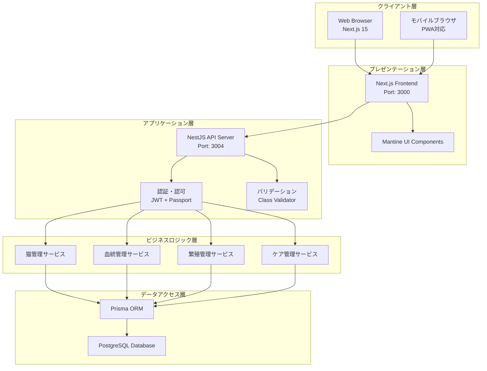
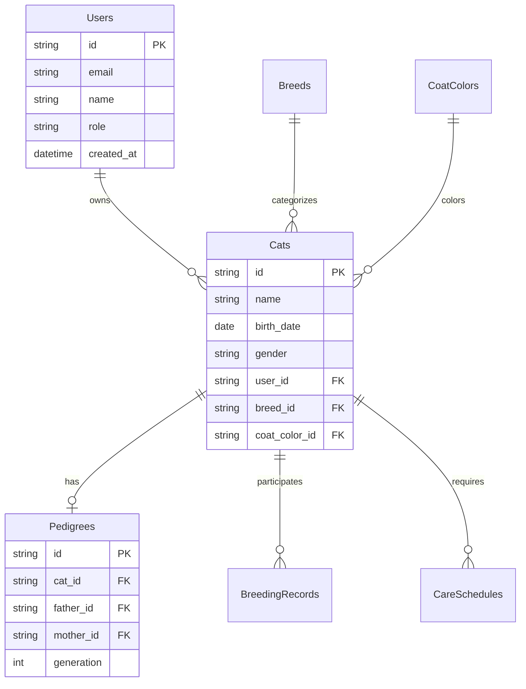
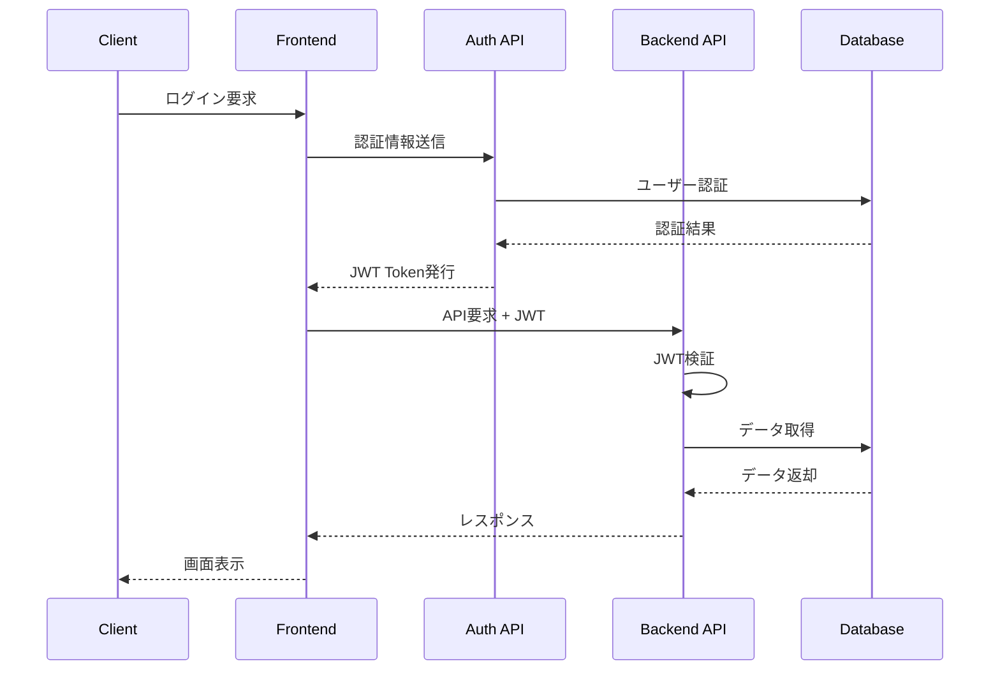
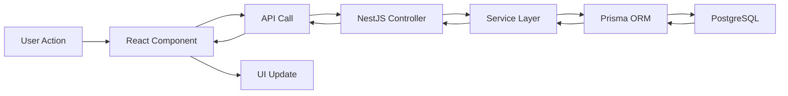
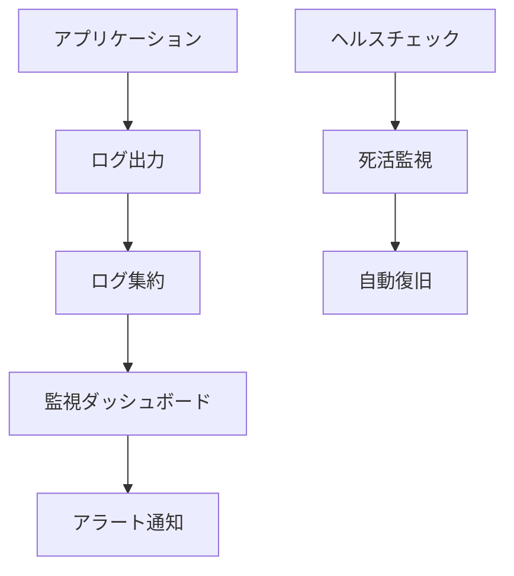

# 🏗️ システム設計書

## 📋 システム概要

**システム名**: 猫生体管理システム (My Cats)  
**アーキテクチャ**: マイクロサービス指向のモノリシック構成  
**設計思想**: TypeScript ファーストによる型安全性とReactベースのSPA

## 🏛️ システムアーキテクチャ

### 全体構成図



### テクニカルスタック

| 層             | 技術スタック                 | バージョン            |
| -------------- | ---------------------------- | --------------------- |
| フロントエンド | Next.js + React + TypeScript | 15.4.5 / 19.1.0 / 5.x |
| UIライブラリ   | Mantine UI + Tailwind CSS    | 8.2.2 / 4.x           |
| バックエンド   | NestJS + TypeScript          | 10.0.0 / 5.x          |
| ORM            | Prisma                       | 6.14.0                |
| データベース   | PostgreSQL                   | 15+                   |
| 認証           | JWT + Passport               | -                     |

## 🔧 コンポーネント設計

### フロントエンド アーキテクチャ

```text
src/
├── app/                    # Next.js App Router
│   ├── layout.tsx         # 共通レイアウト
│   ├── page.tsx           # ホーム画面
│   ├── cats/              # 猫管理ページ
│   ├── pedigrees/         # 血統書管理ページ
│   ├── breeding/          # 繁殖管理ページ
│   ├── care/              # ケア管理ページ
│   └── providers.tsx      # Context Providers
└── components/            # 再利用可能コンポーネント
    ├── ui/               # 基本UIコンポーネント
    ├── forms/            # フォームコンポーネント
    └── layout/           # レイアウトコンポーネント
```

### バックエンド モジュール設計

```text
src/
├── main.ts               # アプリケーションエントリーポイント
├── app.module.ts         # ルートモジュール
├── cats/                 # 猫管理モジュール
│   ├── cats.controller.ts
│   ├── cats.service.ts
│   ├── cats.module.ts
│   └── dto/
├── pedigree/             # 血統管理モジュール
├── breeding/             # 繁殖管理モジュール
├── care/                 # ケア管理モジュール
├── auth/                 # 認証モジュール
├── prisma/               # データベースモジュール
└── common/               # 共通コンポーネント
```

## 🗄️ データベース設計

### ER図概要



### 主要テーブル関係

1. **Users ↔ Cats**: 1対多（ユーザーは複数の猫を所有）
2. **Cats ↔ Pedigrees**: 1対1（各猫は1つの血統記録）
3. **Cats ↔ BreedingRecords**: 多対多（猫は複数の交配に参加）
4. **Cats ↔ CareSchedules**: 1対多（猫は複数のケアスケジュール）

## 🔒 セキュリティ設計

### 認証・認可フロー



### セキュリティ対策

| 項目   | 対策内容                         |
| ------ | -------------------------------- |
| 認証   | JWT Token + Refresh Token        |
| 認可   | Role-based Access Control (RBAC) |
| 通信   | HTTPS強制、CORS設定              |
| データ | SQL Injection対策（Prisma ORM）  |
| XSS    | CSPヘッダー、入力値サニタイズ    |
| CSRF   | SameSite Cookie、CSRFトークン    |

## 📊 API設計

### RESTful API構成

```text
/api/v1/
├── /auth              # 認証関連
│   ├── POST /login    # ログイン
│   └── POST /refresh  # トークンリフレッシュ
├── /cats              # 猫管理
│   ├── GET /          # 猫一覧取得
│   ├── POST /         # 猫登録
│   ├── GET /:id       # 猫詳細取得
│   └── PUT /:id       # 猫情報更新
├── /pedigrees         # 血統管理
├── /breeding          # 繁殖管理
└── /care             # ケア管理
```

### レスポンス設計

```typescript
// 成功レスポンス
interface ApiResponse<T> {
  success: true;
  data: T;
  meta?: {
    total: number;
    page: number;
    limit: number;
  };
}

// エラーレスポンス
interface ApiError {
  success: false;
  error: {
    code: string;
    message: string;
    details?: any;
  };
}
```

## 🔄 データフロー設計

### 状態管理アーキテクチャ



### キャッシュ戦略

| データ種別         | キャッシュ方式       | TTL                |
| ------------------ | -------------------- | ------------------ |
| 静的マスタデータ   | Browser Cache        | 24時間             |
| ユーザーセッション | Memory               | セッション終了まで |
| API レスポンス     | SWR (クライアント)   | 5分                |
| データベース       | Query Cache (Prisma) | 1分                |

## 📱 UI/UX設計

### デザインシステム

- **カラーパレット**: Mantine UI デフォルト + カスタムテーマ
- **タイポグラフィ**: システムフォント優先
- **コンポーネント**: Mantine UI + カスタムコンポーネント
- **レスポンシブ**: Mobile First アプローチ

### 画面構成

```text
Header (ナビゲーション)
├── ログイン/ユーザー情報
├── メインメニュー
└── 検索バー

Main Content
├── サイドバー (メニュー)
└── コンテンツエリア

Footer
├── システム情報
└── ヘルプリンク
```

## 🚀 パフォーマンス設計

### 最適化戦略

| 項目           | 手法                                                |
| -------------- | --------------------------------------------------- |
| フロントエンド | Code Splitting、Tree Shaking、Image Optimization    |
| バックエンド   | N+1問題対策、インデックス最適化、Connection Pooling |
| データベース   | クエリ最適化、適切なインデックス設計                |
| ネットワーク   | CDN、Gzip圧縮、HTTP/2                               |

### パフォーマンス目標

- **First Contentful Paint**: 1.5秒以内
- **Largest Contentful Paint**: 2.5秒以内
- **Cumulative Layout Shift**: 0.1以下
- **API Response Time**: 平均500ms以内

## 🔧 運用設計

### 監視・ログ



### デプロイメント戦略

- **環境**: Development → Staging → Production
- **手法**: Blue-Green Deployment
- **CI/CD**: GitHub Actions
- **ロールバック**: 自動ロールバック対応

---

**文書バージョン**: 1.1  
**最終更新日**: 2025年8月14日  
**設計者**: 開発チーム
